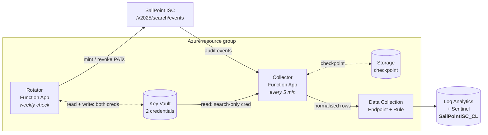

# SailPoint ISC → Microsoft Sentinel

Ships SailPoint Identity Security Cloud audit events into Microsoft Sentinel as
a normalised custom table, so a SOC can build detections on identity governance
activity — admin capability grants, API client creation, leaver deprovisioning
failures, source delete-threshold changes.

Azure-native and self-hosted: two Python Function Apps, Bicep for everything,
no third-party connector and no long-lived credential to babysit.

> **Status:** deployed and running in production by the author. The deployment
> runbook has been followed end to end. Treat it as a working reference
> implementation rather than a packaged product — you are expected to read the
> threat model and decide whether its trade-offs suit your estate.

---

## Why bother

ISC is effectively a Tier 0 system. Whoever controls it can grant themselves
access to anything in the estate — legitimately, with an audit trail saying it
was approved. By the time the effect is visible in a downstream system it looks
authorised, so detection has to happen in the governance layer itself.

That makes ISC audit events high-value SOC telemetry, and it makes the pipeline
carrying them Tier 0 infrastructure in its own right. The design reflects that:
see [`docs/threat-model.md`](docs/threat-model.md).

---

## How it works



**Collector** polls the ISC search API on a timer, normalises each event into a
fixed column shape (keeping the untouched original in `RawEvent`), and writes it
through a Data Collection Rule into Log Analytics.

**Rotator** replaces both ISC credentials on a schedule, with no human in the
loop after first setup. For each, it mints a new Personal Access Token, proves
it works, and persists it — revoking the old ones only once every replacement
is safely in place.

Out of the box the collector polls every 5 minutes, and the rotator checks
weekly and replaces any credential older than 30 days. Every interval is
configurable — see
[Timing and schedules](infra/README.md#timing-and-schedules).

---

## Security properties

These are the load-bearing design decisions. Changing one changes the security
posture, so each is explained in [`docs/threat-model.md`](docs/threat-model.md).

| Property | How |
|---|---|
| **No secret in source, parameters, or deployment history** | There is deliberately no `@secure()` parameter for either ISC credential. Both are seeded once by CLI, then owned by the rotator. Deployment history outlives credentials and is readable by anyone with Reader. |
| **Least privilege between the two apps** | Separate managed identities. Collector gets Key Vault Secrets *User*; only the rotator gets Secrets *Officer*. |
| **Least privilege inside ISC** | Two separate ISC credentials. The collector's is scoped `sp:search:read` and is structurally incapable of minting or deleting tokens. |
| **No storage account key** | `allowSharedKeyAccess: false`. A storage key is an unscopeable, unattributable bearer credential; the class is removed rather than managed. |
| **Rotation cannot strand the pipeline** | Mint → verify → persist → *only then* revoke. Any failure leaves a working credential in place. |
| **No silent data loss** | The ingestion checkpoint never advances past a write the ingestion API has not acknowledged. Re-ingesting duplicates is acceptable; gaps in an audit trail are not. |
| **Credentials are read at runtime** | Not via Key Vault app-setting references, which cache for up to 24h and would serve a revoked credential after a rotation. |

**Alerting is off until you configure it.** A stopped collector means the
identity governance layer is unwatched, which the threat model treats as a
security failure rather than an availability one — but the "collector silent"
and "function failures" rules are only deployed when `alertEmailAddress` is set,
and the example parameter file leaves it empty. Set it before the pipeline
carries anything you rely on.

---

## Getting started

Full runbook: **[`infra/README.md`](infra/README.md)** — prerequisites,
parameters, bootstrap, first rotation, verification and troubleshooting.

The short version:

```bash
az login --tenant <your-tenant-id>
az account set --subscription <your-subscription-id>

RG=rg-iscsiem-prd
LOCATION=uksouth
az group create --name "$RG" --location "$LOCATION"

cp infra/main.bicepparam infra/prd.bicepparam
# edit: environment, iscBaseUrl, alertEmailAddress, workspace options

az deployment group what-if -g "$RG" \
  --template-file infra/main.bicep --parameters infra/prd.bicepparam
```

Then follow the runbook from step 3.

### You will need

- An Azure subscription, and permission to create role assignments in the
  target resource group (**User Access Administrator** or Owner — Contributor
  alone cannot create the role assignments this template needs).
- A region that supports Flex Consumption:
  `az functionapp list-flexconsumption-locations -o table`.
- A SailPoint ISC tenant, and the ability to create a service identity and
  Personal Access Tokens on it.
- Azure CLI, Bicep, Azure Functions Core Tools v4, Python 3.11.

### Bring your own resources

The template creates everything by default, but you can point it at what you
already run. **All of these are set in your parameter file** — copy
`infra/main.bicepparam`, then uncomment and edit what you need. Every option
below is already in that file, commented out, showing its default:

- **`useExistingWorkspace`** — send ISC events to your existing Sentinel
  workspace instead of creating one. Most adopters will want this. Pair it with
  `existingWorkspaceName`, and `existingWorkspaceResourceGroup` if that
  workspace lives in a different resource group.
- **`createOpsWorkspace`** — set `false` to skip the second workspace and keep
  the pipeline's own telemetry in the event workspace.
- **`existingOpsWorkspaceName`** — send that telemetry to an operational
  workspace you already run, such as a central platform-logs one, instead of
  creating a second workspace.
- **`enableSentinel`** — set `false` for plain Log Analytics with no Sentinel.
- **`*NameOverride`** — impose your own naming convention on any resource, plus
  `eventTableName` for the custom table itself.

```bash
cp infra/main.bicepparam infra/prd.bicepparam
# then edit infra/prd.bicepparam
```

Everything commented out falls back to the default declared in
`infra/main.bicep`, so a minimal deployment only needs `environment` and
`iscBaseUrl`.

The resource group and subscription are always yours: the template deploys into
a resource group you create and select.

---

## What it costs

Dominated by Log Analytics/Sentinel ingestion, which scales with your ISC
activity — everything else is close to noise:

- **Ingestion** is the real cost. Sentinel-onboarded data bills at Log
  Analytics rates plus a Sentinel surcharge. Measure your own tenant's event
  volume before extrapolating.
- **Both Function Apps** run on Flex Consumption. Two timer functions at a
  5-minute poll are a very small workload, but check current Flex Consumption
  pricing rather than assuming a free grant covers it.
- **Storage, Key Vault, DCE/DCR** are pennies.

Two levers if ingestion is heavy: raise the collector interval
(`collectorSchedule` — see
[Timing and schedules](infra/README.md#timing-and-schedules)), or narrow what
you collect by editing the search query.

---

## Repository layout

```
infra/
  main.bicep              tables, DCE/DCR, storage, Key Vault, 2 function apps, RBAC, alerts
  main.bicepparam         example parameters (no secrets, no tenant values)
  README.md               deployment runbook — start here
  modules/
    event-table.bicep     custom table + Sentinel onboarding, deployable to another RG
collector/                audit event collector function app
rotator/                  credential rotator function app
docs/
  threat-model.md         what is collected, why, and the trade-offs taken
tests/                    unit tests for the collector and rotator pure logic
```

---

## Contributing

Issues and pull requests welcome. Please read
[`docs/threat-model.md`](docs/threat-model.md) first — several apparently
redundant choices in this codebase are load-bearing, and the reasoning is
recorded there rather than in the diff.

CI runs `bicep build`, a strict `bicep lint`, `pytest`, and a guard that fails
the build if a `@secure()` parameter or a literal secret appears under `infra/`.

```bash
python -m venv .venv && .venv/bin/pip install pytest
.venv/bin/python -m pytest
az bicep build --file infra/main.bicep --stdout > /dev/null
az bicep lint  --file infra/main.bicep
```

## Licence

MIT — see [`LICENSE`](LICENSE).

This project is not affiliated with, endorsed by, or supported by SailPoint or
Microsoft. "SailPoint", "Identity Security Cloud", "Microsoft" and "Sentinel"
are trademarks of their respective owners.
